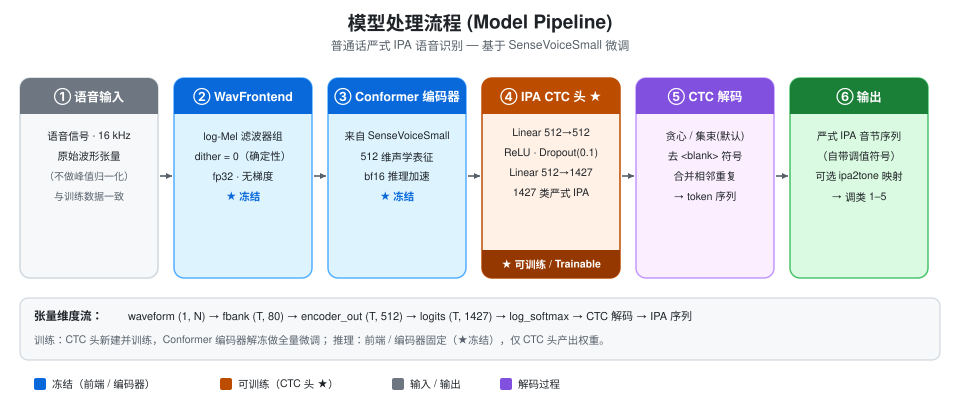

# Nhận dạng giọng nói IPA hẹp (narrow/phonetic) tiếng Phổ Thông

[](https://www.modelscope.cn/models/QiGuanFuChen/mandarin-ipa-asr)

<p align="center">
<a href="README.md"></a>
<a href="README_en.md"></a>
<a href="README_ja.md"></a>
<a href="README_ko.md"></a>
<a href="README_vi.md"></a>
<a href="README_fr.md"></a>
<a href="README_ru.md"></a>
</p>

Dựa trên bộ mã hóa [SenseVoiceSmall](https://github.com/FunAudioLLM/SenseVoice), gắn thêm một **đầu giải mã CTC IPA hẹp (narrow/phonetic)** ở trên, thông qua tinh chỉnh toàn bộ (full fine-tuning) đạt được phiên âm giọng nói tiếng Phổ Thông ở mức "âm tiết + thanh điệu".

Mô hình xuất ra chuỗi âm tiết IPA hẹp phân cách bằng khoảng trắng, mỗi âm tiết mang ký hiệu giá trị thanh điệu riêng (ví dụ `ɡ̊wa̠n̚˥`, `x̞wa̠ɪ̯˧˥`) — tức đồng thời cho cả initial/final và thanh điệu, phù hợp cho phân tích ngữ âm, đánh giá phát âm tiếng Phổ Thông, dạy thanh điệu, v.v.

> Giấy phép: **CC BY-NC-SA 4.0** (Creative Commons Attribution-NonCommercial-ShareAlike 4.0 International).
> Trọng số mô hình và dữ liệu huấn luyện không đi kèm kho mã nguồn; được lấy riêng qua ModelScope và quy trình xây dựng dữ liệu cục bộ. Xem chi tiết bên dưới.


## Quy trình xử lý của mô hình



<p align="center">Hình: quy trình đầu‑cuối từ âm thanh đến chuỗi âm tiết IPA hẹp.</p>

---

## Tính năng

- **Đầu ra IPA hẹp**: áp dụng phương án UntPhesoca hẹp từ [nk2028/putonghua-ipa-converter](https://github.com/nk2028/putonghua-ipa-converter), gán nhãn mức âm vị đồng thời giữ giá trị thanh điệu.
- **Tinh chỉnh toàn bộ**: giải đông (unfreeze) bộ mã hóa Conformer của SenseVoiceSmall và huấn luyện cùng đầu IPA mới tạo; frontend đặc trưng bị đóng băng, `dither=0` đảm bảo tái lập.
- **Chỉ số thanh điệu không phụ thuộc nhãn**: độ chính xác thanh điệu được tính qua bảng ánh xạ `ipa2tone` (âm tiết IPA → lớp thanh 1–5), không phụ thuộc vào ký pháp âm vị cụ thể, thuận tiện cho so sánh công bằng.
- **Xác thực quy mô lớn**: đo thực tế trên tập hợp kiểm tra gộp 5918 mẫu (xem [Chỉ số đánh giá](README.md#效果指标大规模验证)).
- **Demo Gradio**: hỗ trợ tải lên/ghi âm để nhận dạng, và tự động so sánh khác biệt với văn bản tham chiếu (căn chỉnh thanh điệu từng âm tiết kèm tô sáng).

---

## Cấu trúc thư mục

```
mandarin-ipa-asr/
├── LICENSE                                  # Toàn văn CC BY-NC-SA 4.0
├── README.md
├── requirements.txt                         # Các phiên bản依赖 đã đo thực tế
├── .gitignore
├── app.py                                   # Demo Gradio (nhận dạng + tự động so sánh khác biệt)
├── configs/
│   └── example_train_config.json            # Cấu hình huấn luyện mẫu
├── vocab/
│   ├── vocab_mandarin_ipa_combined.json     # Từ vựng đầu ra IPA (1427 lớp, phát hành công khai)
│   └── vocab_mandarin_ipa_tone_combined.json# Ánh xạ âm tiết IPA -> lớp thanh 1-5 (công khai)
├── src/
│   ├── model.py        # SenseVoiceIpa: bộ mã hóa + đầu CTC IPA
│   ├── utils.py        # Giải mã CTC / chỉ số / căn chỉnh / beam search / tải âm thanh
│   ├── dataset.py      # Tập dữ liệu âm thanh-văn bản (wav/flac/ogg/mp3)
│   ├── train.py        # Huấn luyện tinh chỉnh toàn bộ
│   ├── infer.py        # Suy luận đơn + đánh giá hàng loạt (xác thực quy mô lớn)
│   └── prepare_data.py # Xây dựng tập huấn luyện IPA từ văn bản pinyin (tiền xử lý, không có âm thanh)
└── results/
    └── metrics.md       # Chỉ số xác thực đo thực tế và đường cong huấn luyện
```

---

## Mô hình cơ sở

| Mục | Mô tả |
| --- | --- |
| Tên | SenseVoiceSmall (FunAudioLLM / Viện DAMO, Alibaba) |
| Nguồn | GitHub: [FunAudioLLM/SenseVoice](https://github.com/FunAudioLLM/SenseVoice); ModelScope: `iic/SenseVoiceSmall` |
| Cấu trúc | `WavFrontend` (đặc trưng fbank + f0 tùy chọn) + bộ mã hóa Conformer (512 chiều) + đầu CTC chữ Hán gốc |
| Thay đổi của dự án | Đóng băng frontend; gắn thêm một **đầu CTC IPA** mới lên bộ mã hóa Conformer của nó (xem dưới); đầu chữ Hán gốc không còn dùng |

> Trọng số mô hình cơ sở được ModelScope tự động tải xuống và lưu cache khi chạy lần đầu; không cần chuẩn bị thủ công.

---

## Phương pháp huấn luyện

1. **Khởi tạo**: tải `WavFrontend` và `encoder` của SenseVoiceSmall đã huấn luyện trước (bỏ đầu CTC chữ Hán gốc), sau đó tạo đầu CTC IPA mới `ctc_head = Linear(512,512) → ReLU → Dropout(0.1) → Linear(512, vocab)`.
2. **Chiến lược đóng băng**: `WavFrontend` luôn bị đóng băng, `dither` cố định tại 0 (tắt tiêm nhiễu ngẫu nhiên, đảm bảo đặc trưng xác định); bộ mã hóa và đầu IPA **được giải đông và tinh chỉnh toàn bộ** (cũng hỗ trợ chỉ huấn luyện đầu).
3. **Mất mát và tối ưu**: `CTCLoss(blank=0)`; AdamW (`lr=1e-4`, `weight_decay=1e-4`); `CosineAnnealingLR` (`T_max = steps × epochs`); cắt gradient 1.0.
4. **Độ chính xác**: độ chính xác hỗn hợp bf16 (`autocast` chỉ áp dụng cho truyền xuôi bộ mã hóa; đặc trưng và mất mát giữ fp32).
5. **Lưu trọng số**: `best.pt` (TER kiểm tra thấp nhất), `best_tone.pt` (độ chính xác thanh điệu cao nhất).
6. **Tương thích trọng số cũ**: khi suy luận / huấn luyện tiếp, tự động ánh xạ lại tên đầu còn sót lại trong trọng số cũ thành `ctc_head.*` để tránh làm mất đầu một cách thầm lặng.

---

## Dữ liệu huấn luyện

| Mục | Số lượng |
| --- | --- |
| Tập huấn luyện | **11,691** mẫu (đọc tiếng Phổ Thông; lấy từ tập con tiếng Phổ Thông của zhvoice ~8,993 mẫu, tái sử dụng/mở rộng 1.3×) |
| Tập kiểm tra | **918** mẫu (đọc tiếng Phổ Thông, loại trừ với tập huấn luyện) |
| Nhãn | Mỗi mẫu là chuỗi âm tiết IPA hẹp phân cách khoảng trắng (chuyển từ pinyin qua nk2028/putonghua-ipa-converter) |
| Từ vựng IPA | 1,427 lớp (bao gồm `<blank>`/`<unk>`) |

> Bản gốc zhvoice khoảng **900 giờ, 3200+ người nói, ~1.129.800 mục văn bản**;
> dự án chỉ dùng tập con tiếng Phổ Thông chất lượng đọc cao để xây dựng tập huấn luyện/kiểm tra, và chuyển sang IPA hẹp.

---

## Thông số mô hình

| Tham số | Giá trị |
| --- | --- |
| Tổng tham số | **234,993,874** |
| Tham số có thể huấn luyện (tinh chỉnh toàn bộ) | **222,131,699** (bộ mã hóa + đầu IPA; frontend và đầu chữ Hán gốc bị đóng băng) |
| Chỉ suy luận (đầu có thể huấn luyện, bộ mã hóa đóng băng) | 994,707 |
| Chiều bộ mã hóa | 512 |
| Từ vựng đầu ra IPA | 1,427 |
| Số mục ánh xạ thanh điệu (ipa2tone) | 1,425 (trừ `<blank>`/`<unk>`) |

---

## Nguồn tập dữ liệu và liên kết

| Dữ liệu / Công cụ | Mục đích | Giấy phép | Liên kết |
| --- | --- | --- | --- |
| **zhvoice** | Kho ngữ liệu huấn luyện (tập con đọc tiếng Phổ Thông) | Xem repo | https://github.com/fighting41love/zhvoice |
| **putonghua-ipa-converter** | Chuyển pinyin → IPA hẹp (scheme 2, UntPhesoca) | CC0 | https://github.com/nk2028/putonghua-ipa-converter |
| **SenseVoiceSmall** | Mô hình cơ sở huấn luyện trước | Xem repo | https://github.com/FunAudioLLM/SenseVoice (ModelScope `iic/SenseVoiceSmall`) |

---

## Chỉ số đánh giá (xác thực quy mô lớn)

Giải mã hoàn toàn nhất quán với huấn luyện (đầu vào dạng sóng thô, dither=0, truyền xuôi bộ mã hóa bf16). Định nghĩa chỉ số xem trong [`results/metrics.md`](results/metrics.md).

### 918 mẫu kho ngữ liệu kiểm tra tiếng Phổ Thông hạng nhất (Nhất giáp)

| Chỉ số | Giá trị |
| --- | --- |
| TER (tỷ lệ lỗi âm tiết, thấp hơn tốt hơn) | **0.0955** |
| ACC (khớp toàn câu chính xác) | 0.7059 |
| TACC (độ chính xác token) | 0.9145 |
| Độ chính xác thanh điệu (không phụ thuộc nhãn) | **0.9212** |

### 5918 mẫu tập kiểm tra gộp (xác thực quy mô lớn)

= 5000 mp3 bối cảnh thực của zhvoice + 918 mẫu đọc tiếng Phổ Thông. zhvoice là bối cảnh thực, lĩnh vực đa dạng hơn và ồn hơn, nên ACC toàn câu thấp hơn kho kiểm tra tiếng Phổ Thông Nhất giáp là dự kiến; nhận dạng thanh điệu vẫn giữ mức cao.

| Chỉ số | Giá trị |
| --- | --- |
| TER (tỷ lệ lỗi âm tiết, thấp hơn tốt hơn) | **0.1089** |
| ACC (khớp toàn câu chính xác) | 0.4439 |
| TACC (độ chính xác token) | 0.8986 |
| Độ chính xác thanh điệu (không phụ thuộc nhãn) | **0.8915** |

> Ghi chú: độ chính xác thanh điệu tương đương với các mô hình tương tự dưới sơ đồ pinyin (cùng khung, đầu pinyin thanh điệu ~0.92, đầu IPA này 0.89–0.92), chứng minh dưới chú thích chung "âm vị + thanh điệu", thông tin thanh điệu không bị mất.

---

## Cài đặt và môi trường (đều đo thực tế)

| Dependency | Phiên bản | Ghi chú |
| --- | --- | --- |
| Python | **3.9.13** | Khuyên dùng 3.9 (3.8–3.11 nên chạy được; đã đo 3.9.13) |
| CUDA | **12.8** | Huấn luyện/suy luận cần GPU NVIDIA; chỉ CPU cũng suy luận được nhưng chậm |
| torch | 2.7.0+cu128 | tương ứng CUDA 12.8 |
| torchaudio | 2.7.0+cu128 | |
| funasr | 1.4.16 | tải SenseVoiceSmall |
| modelscope | 1.32.0 | tự động tải mô hình cơ sở |
| transformers | 4.43.0 | |
| numpy | 1.23.4 | |
| editdistance | 0.6.2 | tính chỉ số |
| tqdm | 4.64.1 | thanh tiến trình |
| soundfile | 0.12.1 | đọc/ghi âm thanh |
| gradio | 4.24.0 | giao diện demo |
| librosa | 0.9.2 | (tùy chọn) tiền xử lý dữ liệu |
| ffmpeg | 2025-08-23 | giải mã mp3 (phải có trong PATH) |

Cài đặt:

```bash
pip install -r requirements.txt
# ffmpeg cần cài riêng và thêm vào PATH (Windows: https://www.gyan.dev/ffmpeg/ hoặc scoop/apt)
```

**Yêu cầu thiết bị**: huấn luyện khuyên ≥ 16 GB VRAM (tinh chỉnh toàn bộ 234M tham số + kích hoạt dưới bf16); suy luận chỉ cần vài GB, một đoạn âm thanh đơn cũng chạy được trên CPU (chậm).

---

## Bắt đầu nhanh

> Tất cả script đều phân giải `vocab/`, `data/`, `weights/`, `checkpoints/` và các đường dẫn tương đối khác dựa trên "thư mục gốc dự án" (tức gốc repo), nên **không cần `cd` vào thư mục gốc dự án mà vẫn chạy từ bất kỳ thư mục làm việc nào**; truyền đường dẫn tuyệt đối thì dùng nguyên bản.
> Mô hình cơ sở `iic/SenseVoiceSmall` là model id của ModelScope, sẽ tự động tải xuống và lưu cache khi chạy lần đầu.

> ### 【Quan trọng】Phải tải trọng số tinh chỉnh trước, nếu không đầu ra là rác vô nghĩa
>
> Dự án này **không đặt trọng số mô hình vào repo** (phát hành riêng trên ModelScope). Nếu khởi động demo hoặc suy luận **mà không chỉ định trọng số qua `--ckpt`**,
> chương trình sẽ thầm lặng dùng một mô hình **khởi tạo ngẫu nhiên** — IPA nó phát ra cho âm thanh sẽ vô nghĩa và thường lặp lại âm tiết,
> trông như "nhận dạng ra rất nhiều", nhưng hoàn toàn không phải phát âm thật.
> Ví dụ: nửa đầu 《Tĩnh dạ tứ》(静夜思) chỉ có khoảng 10 âm tiết, nhưng không có trọng số có thể xuất ra 30+ âm tiết rác lặp lại.
>
> Cách dùng đúng (trọng số phải tải về `weights/best.pt` trước, xem mục sau):
> ```bash
> python app.py --ckpt weights/best.pt
> ```
> Nếu không chỉ định `--ckpt`, `app.py` sẽ tự động thử định vị `weights/best.pt`; nếu cả hai đều không có, khi khởi động sẽ in 【cảnh báo】 nổi bật.

### 1. Lấy trọng số mô hình

Trọng số mô hình **không có trong repo này**; tải từ ModelScope (tác giả phát hành riêng), ví dụ:

```bash
# Giả sử mô hình đã phát hành, dùng modelscope tải về cục bộ
modelscope download --model QiGuanFuChen/mandarin-ipa-asr --local_dir weights/
```

Sau khi có `weights/best.pt`, chỉ định qua `--ckpt`. (Nếu tự huấn luyện, sẽ sinh thêm `checkpoints/best_tone.pt`; xem "Hướng dẫn huấn luyện" dưới)

### 2. Suy luận một đoạn âm thanh

```bash
# Không cần cd vào thư mục gốc: script phân giải vocab/data tương đối theo vị trí của nó; chạy từ bất kỳ thư mục nào
python src/infer.py --wav path/to/audio.wav --ckpt weights/best.pt
# Đầu ra: chuỗi âm tiết IPA hẹp phân cách khoảng trắng
```

### 3. Đánh giá hàng loạt (chỉ số kiểm tra)

```bash
python src/infer.py --eval --ckpt weights/best.pt \
    --val_scp data/val.scp --val_text data/val.text --limit 0
# Xuất TER / ACC / TACC / độ chính xác thanh điệu
```

### 4. Demo Gradio (tải âm thanh lên + tự động so sánh khác biệt)

> Nhất định tải trọng số qua `--ckpt` (xem 【Quan trọng】 trên), nếu không kết quả nhận dạng là rác vô nghĩa khởi tạo ngẫu nhiên.
> Tab "Nhận dạng" mặc định dùng beam search (`--beam`, mặc định 12) để giảm lỗi chèn/lặp; `--beam 0` quay lại giải mã tham lam (greedy).

```bash
# Chạy từ bất kỳ thư mục nào (đường dẫn tương đối phân giải theo gốc dự án); --ckpt nhận đường dẫn tương đối hoặc tuyệt đối
# Nếu bỏ --ckpt, sẽ tự thử weights/best.pt
python app.py --ckpt weights/best.pt --port 7860
# Mở http://127.0.0.1:7860 trên trình duyệt
```

- **Tab Nhận dạng**: tải lên hoặc ghi âm → xuất IPA hẹp.
- **Tab So sánh (tự động khác biệt)**: tải âm thanh lên và (tùy chọn) điền văn bản IPA tham chiếu →
  tự động căn chỉnh thanh điệu từng âm tiết và tô sáng khác biệt (đúng / sai thanh / đọc sai / thừa / thiếu);
  ngay cả không có văn bản tham chiếu, cũng tự so sánh hai kết quả giải mã "tham lam vs beam search".

---

## Hướng dẫn huấn luyện

1. Chuẩn bị dữ liệu (xem "Ghi chú sử dụng dữ liệu" dưới) để có `train.scp` / `train.text` / `val.scp` / `val.text`
   (định dạng: `uid đường_dẫn_âm_thanh` và `uid âm_tiết_IPA_cách_khoảng_trắng`).
2. Chạy:

```bash
python src/train.py \
    --train_scp data/train.scp --train_text data/train.text \
    --val_scp data/val.scp --val_text data/val.text \
    --vocab_path vocab/vocab_mandarin_ipa_combined.json \
    --ipa2tone_path vocab/vocab_mandarin_ipa_tone_combined.json \
    --output_dir checkpoints --epochs 10 --batch_size 16
```

Cũng có thể ghi tham số vào `configs/example_train_config.json` rồi chạy đơn giản:

```bash
python src/train.py $(python -c "import json,sys; c=json.load(open('configs/example_train_config.json')); print(' '.join(f'--{k} {v}' for k,v in c.items()))")
```

- Để warm-start từ trọng số tinh chỉnh toàn bộ pinyin: `--warm_start weights/pinyin_ft.pt` (kích thước đầu khác sẽ tự bỏ qua và khởi tạo ngẫu nhiên).
- Xuất `checkpoints/best.pt` (TER thấp nhất) và `checkpoints/best_tone.pt` (thanh điệu cao nhất).

---

## Ghi chú sử dụng dữ liệu (dữ liệu không công khai)

Vì giấy phép và quy mô, **dữ liệu huấn luyện không phát hành trực tiếp**. Bạn có thể tái tạo tập dữ liệu tương đương theo các bước:

1. Tải kho ngữ liệu **zhvoice** (https://github.com/fighting41love/zhvoice), giải nén lấy âm thanh và văn bản pinyin.
2. Clone **putonghua-ipa-converter** (https://github.com/nk2028/putonghua-ipa-converter), dùng `data/putonghua.js` (scheme 2 = UntPhesoca hẹp) của nó chuyển pinyin sang IPA hẹp.
3. Dùng `src/prepare_data.py` của repo này sinh các file cần cho huấn luyện:

```bash
# 1) tập con zhvoice -> văn bản IPA hẹp + scp + từ vựng
#    --conv_js trỏ đến data/putonghua.js của bộ chuyển; --audio_root là thư mục gốc âm thanh
python src/prepare_data.py build-zhvoice \
    --metadata zhvoice/metadata.csv \
    --audio_root zhvoice/wavs \
    --conv_js path/to/putonghua-ipa-converter/data/putonghua.js \
    --out data/zhvoice_ipa --train_n 8993 --val_n 918

# 2) chuyển văn bản pinyin có dấu thanh của riêng bạn sang IPA (thư mục cần chứa train/text, val/text)
python src/prepare_data.py build-mandarin \
    --text_dir data/mandarin_pinyin \
    --conv_js path/to/putonghua-ipa-converter/data/putonghua.js \
    --out data/zhvoice_ipa

# 3) gộp nhiều nguồn và mở rộng từ vựng, xuất file *_combined
python src/prepare_data.py combine \
    --zhvoice_dir data/zhvoice_ipa --mandarin_ipa_dir data/zhvoice_ipa \
    --out data/combined

# 4) mở rộng tập huấn luyện theo hệ số (vd 1.3×): lấy tập con tiếng Phổ Thông làm cơ sở, trộn thêm dữ liệu zhvoice
python src/prepare_data.py scale \
    --mandarin_text data/combined/train_text --mandarin_scp data/combined/train_scp \
    --zhvoice_text data/zhvoice_ipa/train_text --zhvoice_scp data/zhvoice_ipa/train_scp \
    --factor 1.3 --out data/ipa130
```

Các file `*.scp` (đường dẫn âm thanh) và `*.text` (nhãn IPA) sinh ra có thể dùng làm đầu vào cho `train.py` / `infer.py`.
**Không phát hành âm thanh gốc hoặc văn bản bên thứ ba cùng repo này**, chỉ phát hành các script và hướng dẫn sử dụng trên.

---

## Giấy phép

Mã nguồn và từ vựng phát hành dưới **CC BY-NC-SA 4.0** (Creative Commons Attribution-NonCommercial-ShareAlike 4.0 International; xem [LICENSE](LICENSE)).
- **Ghi nhận tác giả (BY / Attribution)**: khi sử dụng vui lòng giữ nguyên tác giả gốc và nguồn gốc dự án.
- **Phi thương mại (NC / NonCommercial)**: không được dùng cho mục đích thương mại.
- **Chia sẻ tương tự (SA / ShareAlike)**: tác phẩm phái sinh phải phát hành dưới cùng giấy phép.

Trọng số mô hình và dữ liệu huấn luyện được cung cấp riêng theo giấy phép nguồn gốc tương ứng (ModelScope / repo nguồn dữ liệu) và không ghi đè lên giấy phép của repo này.

---

## Trích dẫn và cảm ơn

- Mô hình cơ sở: FunAudioLLM, *SenseVoice*.
- Chuyển IPA hẹp: nk2028, *putonghua-ipa-converter* (CC0).
- Kho ngữ liệu huấn luyện: fighting41love, *zhvoice*.

---

<p align="center">
<a href="README.md"></a>
<a href="README_en.md"></a>
<a href="README_ja.md"></a>
<a href="README_ko.md"></a>
<a href="README_vi.md"></a>
<a href="README_fr.md"></a>
<a href="README_ru.md"></a>
</p>
